# Instalación y configuración del servidor web Nginx: Virtual Hosts
Antes de todo, todo este proceso es posterior a la correcta instalación de nginx.

Nos dirijimos al directorio /etc/nginx.
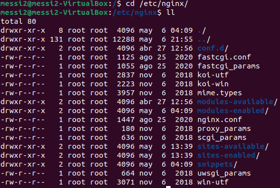
Aquí nos tendremos que fijar en el directorio sites-available y entrar en él.
Una vez dentro copiaremos el archivo "default" con el nombre de los dos dominios que queramos tener.
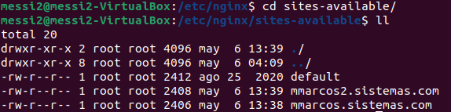
Una vez creamos los modificamos usando vim.
Y dentro de cada uno de ellos deberemos cambiar el root para que apunte a la carpeta que deseamos y server_name para que tenga el nombre del dominio que queramos.
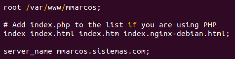
También debemos cambiar un parámetro de server para que no tenga un default y quede así:
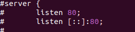
Lo repetimos con el otro archivo.
Una vez hecho esto nos dirijimos al directorio /etc/nginx/sites-enabled y ejecutamos ln -s /ruta/origen/archivo /ruta/destino/archivo, una vez ejecutado esto con cada sitio deberían aparecer dentro de sites-enabled.
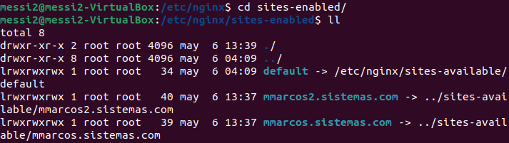
Ahora debemos reiniciar nginx.
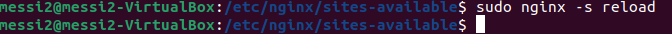
Bien, ahora debemos hacer que cuando nuestro navegador visite estos dominios les dirija a nuestra ip.
Nos dirijimos a /etc y modificamos con vim el archivo "hosts" para que nuestros dominios sean equivalentes a nuestra ip:
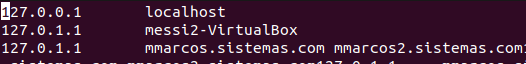
Ahora solo faltaría darle unos html a los dominios, para esto nos dirijimos a cd/var/www/ y creamos un directorio para cada dominio.
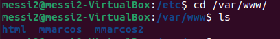
Nos dirijimos dentro de la carpeta del directorio, creamos un archivo que se llame index.html y añadimos el código dentro.
Repetimos con el otro dominio.
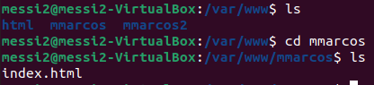
Con esto ya estaría finalizado, comprobamos que funciona
Primer dominio:
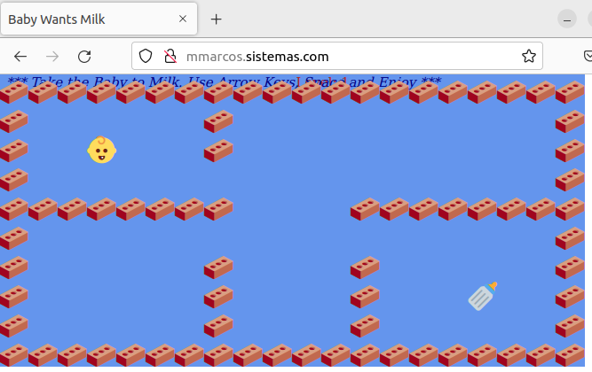
Segundo dominio:
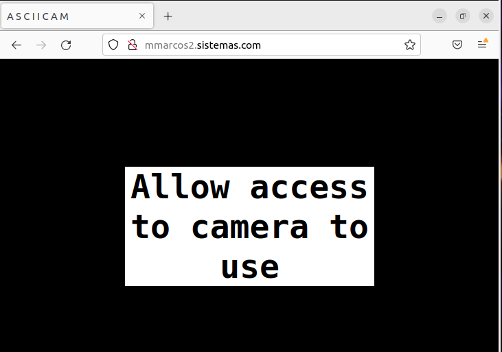
Con esto ya tendríamos nuestros dos subdominios distintos operativos 
